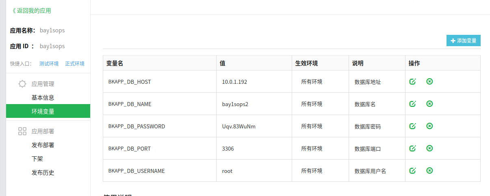

Base: Ubuntu + Python2.7 + bk-sops V3.1

**PS：更详细教程在这里 https://docs.bk.tencent.com/gcloud/term3.html**

> 如果不需要进行二次开发，请直接在releases中获取打包好的版本，上传部署升级官方标准运维SaaS
https://github.com/Tencent/bk-sops/releases

**首先需要提醒：**

- 插件部署方式有几种，我使用的就是上述的源码上传

- 支持Python2.x，不支持Python3.x

- Windows安装pip依赖时，可能缺少一些C++编译依赖，我换到Ubuntu本地开发的

- 新建应用需要开白名单，否则get_client_by_xxx报错，可能不是代码错误，是没有白名单权限

- 使用官方仓库打包版本，记得python manage.py collectstatic –noinput

- 没有开celery会有如下错误 https://docs.bk.tencent.com/product_white_paper/gcloud/FAQ.html

## 正式部分

### 初始准备

>下载打包好的releases，并在本地配置好Python2.7环境和依赖

### 配置Config

>修改数据库配置等，settings_production.py & settings_saas.py 获取环境变量
可执行以下命令在环境中注入变量，文件内容需要在自己修改

```bash
source env.sh
‵‵‵

>相对应的你需要在开发者中心添加应用环境变量



#### startapp

>根目录下执行

‵‵‵bash
python manage.py startapp custom_atoms 
```

>然后在 cusstom_atoms 中新建 components/collections 和 static/custom_atoms 目录
>打开conf/settings_custom.py文件，找到INSTALL_APPS_CUSTOM，加入创建的custom_atoms

### 接入自助的api

> 按照上次作业一样方式， 添加自助磁盘容量查询api，以便于client能直接调用

#### 封装到client

**在blueking/component/apis添加你的接口文件，命名可以直接是get_dfusage_xxx**

```python
# -*- coding: utf-8 -*-
from ..base import ComponentAPI


class CollectionsGetDfusagexxx(object):
    """Collections of get_dfusage_xxx APIS"""

    def __init__(self, client):
        self.client = client

        self.get_dfusage_xxx = ComponentAPI(
            client=self.client, method='GET',
            path='/api/c/self-service-api/api/get_dfusage_xxx/',
            description=u'获取指定磁盤容量'
        )
```

**其中的path即你和助手沟通好的注册API路径**

在blueking/component/collections.py 添加你刚才写的函数，比如

```python
from .apis.get_dfusage_xxx import CollectionsGetDfusagexxx

# Available components
AVAILABLE_COLLECTIONS = {
    ...
    'self_server': CollectionsGetDfusagexxx
}

```

#### 在custom_atoms/components/collections 目录下创建 test.py 文件

>示例内容如下

```python
# -*- coding: utf-8 -*-
from django.utils.translation import ugettext_lazy as _

from pipeline.conf import settings
from pipeline.core.flow.activity import Service
from pipeline.component_framework.component import Component
from blueking.component.shortcuts import get_client_by_user

__group_name__ = _(u"个人服务(SELFAPI)")


class GetDfuasgeService(Service):
    __need_schedule__ = False  # 是否异步执行

    def execute(self, data, parent_data):
        executor = parent_data.get_one_of_inputs('executor')
        client = get_client_by_user(executor)

        host_ip = data.get_one_of_inputs('self_server_ip')
        host_system = data.get_one_of_inputs('self_server_system')
        hsot_disk = data.get_one_of_inputs('self_server_disk')

        api_kwargs = {
            'ip': host_ip,
            'system': host_system,
            'disk': hsot_disk
        }
        api_result = client.self_server.get_dfusage_xxx(api_kwargs)

        if api_result['result']:
            data.set_outputs('data', api_result)
            data.set_outputs('message', api_result)
            return True
        else:
            data.set_outputs('ex_data', api_result['message'])
            return False

    def outputs_format(self):
    	"""
    	这里其实就是你完成执行想要看到的输出，对应set_outputs的key
    	"""
        return [
            self.OutputItem(name=_(u'查询结果'), key='data', type='list'),
            self.OutputItem(name=_(u'返回信息'), key='message', type='str'),
            self.OutputItem(name=_(u'异常信息'), key='ex_data', type='str')
        ]


class GetDfuasgeComponent(Component):
    name = _(u'磁盘容量查询')
    code = 'self_server_get_dfusage'
    bound_service = GetDfuasgeService
    form = settings.STATIC_URL + 'custom_atoms/test/self_server_get_dfusage.js'
```

>custom_atoms/static/custom_atoms 目录下创建 test 目录，并创建 test_custom.js 文件
>注意文件路径和标准插件后台定义的 form 保持一致

```js
(function(){
    $.atoms.self_server_get_dfusage = [
        {
            tag_code: "self_server_ip",
            type: "input",
            attrs: {
                name: "主机IP",
                hookable: true,
                default: '10.0.1.192',
                validation: [
                    {
                        type: "required"
                    }
                ]
            },
        },
        {
            tag_code: "self_server_system",
            type: "input",
            attrs: {
                name: "主机系统",
                default: "linux centos",
                hookable: true,
                validation: [
                    {
                        type: "required"
                    }
                ]
            }
        },
        {
            tag_code: "self_server_disk",
            type: "input",
            attrs: {
                name: "主机磁盘",
                hookable: true,
                default: '/',
                validation: [
                    {
                        type: "required"
                    }
                ]
            },
        },
    ]
})();
```

>本地调试,执行下面命令

```bash
python manage.py runserver
python manage.py celery worker -l info
```
>新建应用，找助手开通白名单，或者直接覆盖掉你的上一个已经建好的应用
即使用以前作业已经开通白名单的应用token

>找助手，新建数据库，修改conf/文件夹 内相应文件
或者直接按照上文提到的环境变量方式, 上传代码部署

